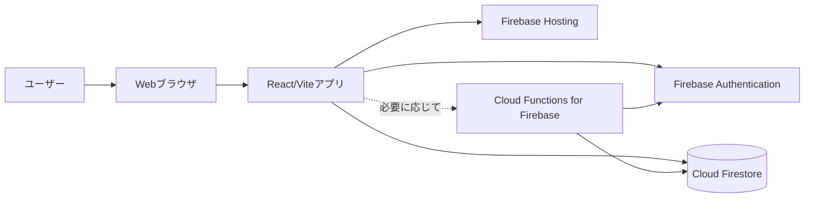
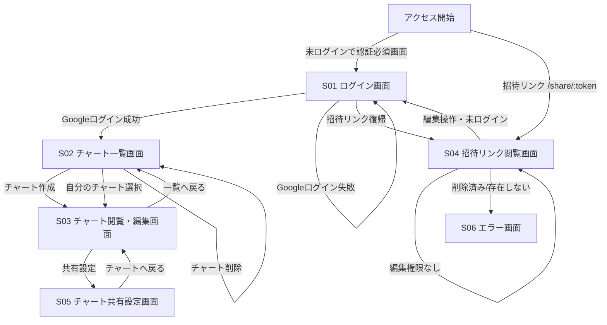
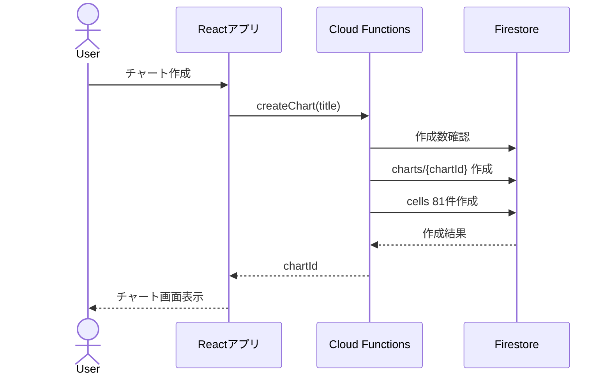
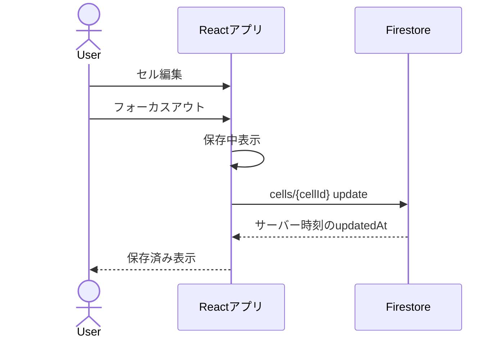
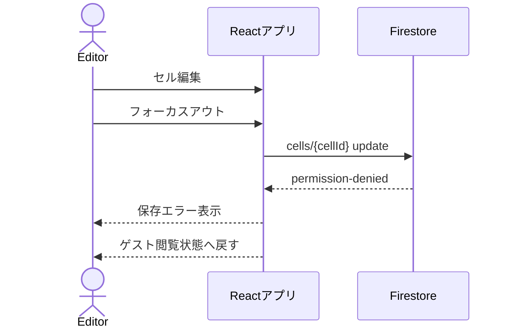

# マンダラチャート共有アプリ 基本設計書

## 1. システム構成

### 1.1 全体構成



### 1.2 構成要素

| 要素 | 役割 |
| --- | --- |
| React/Viteアプリ | 画面表示、9x9チャートUI、フォーカスアウト保存、招待リンク閲覧、Firebase SDK呼び出しを行う。 |
| Firebase Authentication | Googleログイン、ログイン状態管理、ユーザー識別を行う。 |
| Cloud Firestore | ユーザー、チャート、セル、編集者権限を保存する。 |
| Firebase Hosting | React/Viteのビルド成果物を配信する。 |
| Cloud Functions for Firebase | Firestore Security Rulesだけでは担保しづらい処理を補助する。MVPではチャート作成、招待リンク発行、編集者管理、論理削除に利用する。 |

### 1.3 基本方針

- 認証はFirebase AuthenticationのGoogleログインのみとする。
- データはCloud Firestoreに保存する。
- 配信はFirebase Hostingを利用する。
- Firestore Security Rulesで閲覧・編集権限を必ず制御する。
- チャート作成時の81セル初期作成、チャート作成上限5件、招待リンクトークン生成などはCloud Functionsで実行する。
- 作成者は自分のチャートを一覧から開ける。
- 編集者とゲストは招待リンクからのみチャートを開く。
- 招待リンク経由の初期表示は、ログイン済みでもゲスト閲覧とする。
- 編集アクション時にFirebase Authenticationのログイン状態とFirestore上の編集者権限を確認する。
- チャート削除は論理削除とする。
- セル保存はフォーカスアウト時に行う。
- スマートフォンは閲覧中心とし、編集最適化は初期リリース対象外とする。

## 2. 画面一覧

| 画面ID | 画面名 | URL例 | 主な利用者 | 概要 |
| --- | --- | --- | --- | --- |
| S01 | ログイン画面 | `/login` | 未ログインユーザー | Googleログインボタンとログイン失敗時のエラーを表示する。 |
| S02 | チャート一覧画面 | `/charts` | ログイン済みユーザー | 自分が作成したチャートのみ表示し、作成・削除・選択を行う。 |
| S03 | チャート閲覧・編集画面 | `/charts/:chartId` | チャート作成者 | 一覧から開いた作成者向けの編集画面。タイトル編集、セル編集、共有設定遷移が可能。 |
| S04 | 招待リンク閲覧画面 | `/share/:token` | ゲスト閲覧者、編集者 | 招待リンクから開く画面。初期状態はゲスト閲覧。編集操作時にログイン・権限確認を行う。 |
| S05 | チャート共有設定画面 | `/charts/:chartId/share` | チャート作成者 | 招待リンク発行・コピー、編集許可メールアドレスの追加・削除を行う。 |
| S06 | エラー画面 | `/error` または各画面内表示 | 全ユーザー | 権限なし、削除済み、存在しないチャート、ログイン失敗などを表示する。 |

## 3. 画面遷移図



## 4. Firestore設計

### 4.1 コレクション構成

```text
users/{uid}
charts/{chartId}
charts/{chartId}/cells/{cellId}
charts/{chartId}/editors/{editorId}
inviteLinks/{token}
```

### 4.2 データモデル

#### users/{uid}

| フィールド | 型 | 必須 | 説明 |
| --- | --- | --- | --- |
| uid | string | yes | Firebase AuthenticationのUID。 |
| email | string | yes | Googleアカウントのメールアドレス。小文字化して保存。 |
| displayName | string | no | Google由来の表示名。 |
| photoURL | string | no | Google由来のプロフィール画像URL。 |
| createdAt | timestamp | yes | 作成日時。サーバー時刻。 |
| updatedAt | timestamp | yes | 更新日時。サーバー時刻。 |

#### charts/{chartId}

| フィールド | 型 | 必須 | 説明 |
| --- | --- | --- | --- |
| id | string | yes | チャートID。 |
| ownerUid | string | yes | 作成者UID。 |
| title | string | yes | チャートタイトル。 |
| inviteToken | string | no | 招待リンク用トークン。 |
| isDeleted | boolean | yes | 論理削除状態。 |
| deletedAt | timestamp | no | 論理削除日時。 |
| createdAt | timestamp | yes | 作成日時。サーバー時刻。 |
| updatedAt | timestamp | yes | 更新日時。サーバー時刻。 |

#### charts/{chartId}/cells/{cellId}

| フィールド | 型 | 必須 | 説明 |
| --- | --- | --- | --- |
| id | string | yes | セルID。`r{row}c{col}` 形式を推奨する。 |
| rowIndex | number | yes | 行番号。0から8。 |
| colIndex | number | yes | 列番号。0から8。 |
| body | string | yes | セル本文。テキストのみ。空文字を許容する。 |
| updatedByUid | string | no | 最終更新者UID。 |
| createdAt | timestamp | yes | 作成日時。サーバー時刻。 |
| updatedAt | timestamp | yes | 更新日時。サーバー時刻。 |

#### charts/{chartId}/editors/{editorId}

| フィールド | 型 | 必須 | 説明 |
| --- | --- | --- | --- |
| id | string | yes | 編集者権限ID。 |
| allowedEmail | string | yes | 編集を許可するメールアドレス。小文字化して保存。 |
| addedByUid | string | yes | 追加した作成者UID。 |
| createdAt | timestamp | yes | 作成日時。サーバー時刻。 |
| updatedAt | timestamp | yes | 更新日時。サーバー時刻。 |

#### inviteLinks/{token}

| フィールド | 型 | 必須 | 説明 |
| --- | --- | --- | --- |
| token | string | yes | 招待リンクトークン。ドキュメントIDと同一。 |
| chartId | string | yes | 対象チャートID。 |
| createdByUid | string | yes | 発行者UID。 |
| createdAt | timestamp | yes | 作成日時。サーバー時刻。 |

### 4.3 インデックス

| 対象 | 用途 |
| --- | --- |
| `charts ownerUid + isDeleted + updatedAt desc` | 作成者向けチャート一覧。 |
| `charts/{chartId}/editors allowedEmail` | 編集権限確認。 |

## 5. Firebase操作設計

### 5.1 Firebase Authentication

| 操作 | SDK/API | 概要 |
| --- | --- | --- |
| Googleログイン | `signInWithPopup` または `signInWithRedirect` | Googleアカウントでログインする。 |
| ログアウト | `signOut` | ログアウトする。 |
| ログイン状態監視 | `onAuthStateChanged` | 画面表示時にログイン状態を確認する。 |

### 5.2 Firestore直接操作

| 操作 | 対象 | 権限 |
| --- | --- | --- |
| チャート一覧取得 | `charts` query | ログイン済みユーザー。`ownerUid == auth.uid` かつ `isDeleted == false`。 |
| 作成者チャート取得 | `charts/{chartId}` + `cells` | 作成者のみ。 |
| 招待リンク閲覧 | `inviteLinks/{token}` + `charts/{chartId}` + `cells` | 未ログイン含む全員。ただし削除済みは不可。 |
| セル保存 | `charts/{chartId}/cells/{cellId}` | 作成者または編集者のみ。 |

### 5.3 Cloud Functions

MVPでは、以下はCallable Functionsとして実装する。

| 関数名 | 認証 | 概要 |
| --- | --- | --- |
| `createChart` | 必須 | チャートを作成し、81セルを初期作成する。作成上限5件を検証する。 |
| `deleteChart` | 必須 | 作成者のみ、チャートを論理削除する。 |
| `createInviteLink` | 必須 | 作成者のみ、推測困難な招待リンクトークンを生成する。 |
| `addEditor` | 必須 | 作成者のみ、編集許可メールアドレスを追加する。 |
| `removeEditor` | 必須 | 作成者のみ、編集者を削除する。 |
| `verifyEditorAccess` | 必須 | 招待リンク画面で、ログイン中ユーザーが編集可能か確認する。 |

### 5.4 Cloud Functionsの主なエラー

| code | 概要 |
| --- | --- |
| `unauthenticated` | ログインが必要。 |
| `permission-denied` | 操作権限がない。 |
| `not-found` | チャートまたは招待リンクが存在しない。 |
| `already-exists` | 編集者メールアドレスが登録済み。 |
| `resource-exhausted` | チャート数または編集者数の上限に達している。 |
| `invalid-argument` | タイトル、メールアドレス、セル本文などの入力値が不正。 |

## 6. Security Rules設計

### 6.1 基本方針

- Firestore Security Rulesで必ず読み書き権限を制御する。
- Cloud FunctionsからのAdmin SDK操作はSecurity Rulesをバイパスするため、Functions側で同等以上の権限チェックを行う。
- セル本文とタイトルは文字列として保存し、HTMLとして扱わない。
- 招待リンク閲覧は未ログインでも許可するが、編集は許可しない。

### 6.2 権限マトリクス

| 操作 | 作成者 | 編集者 | ゲスト | 権限なしログインユーザー |
| --- | --- | --- | --- | --- |
| Googleログイン | 可 | 可 | 任意 | 可 |
| チャート作成 | 可 | 可 | 不可 | 可 |
| 自分のチャート一覧閲覧 | 可 | 可 | 不可 | 可 |
| 一覧画面から対象チャート閲覧 | 可 | 不可 | 不可 | 不可 |
| 招待リンク経由の対象チャート閲覧 | 可 | 可 | 可 | 可 |
| セル編集 | 可 | 可 | 不可 | 不可 |
| チャートタイトル編集 | 可 | 不可 | 不可 | 不可 |
| チャート削除 | 可 | 不可 | 不可 | 不可 |
| 招待リンク発行 | 可 | 不可 | 不可 | 不可 |
| 編集者追加 | 可 | 不可 | 不可 | 不可 |
| 編集者削除 | 可 | 不可 | 不可 | 不可 |
| 画像出力 | 不可 | 不可 | 不可 | 不可 |
| PDF出力 | 不可 | 不可 | 不可 | 不可 |

### 6.3 ルール概要

```text
users/{uid}
  read/write: request.auth.uid == uid

charts/{chartId}
  read: 作成者、または招待リンク経由で取得される公開閲覧処理
  create/update/delete: 原則クライアント直接書き込み不可。Cloud Functions経由。

charts/{chartId}/cells/{cellId}
  read: 作成者、編集者、または招待リンク経由のゲスト閲覧
  update: 作成者または編集者

charts/{chartId}/editors/{editorId}
  read/write: 原則クライアント直接書き込み不可。Cloud Functions経由。

inviteLinks/{token}
  read: 全員
  write: 原則クライアント直接書き込み不可。Cloud Functions経由。
```

## 7. 実装上の補足

### 7.1 チャート作成処理



### 7.2 フォーカスアウト自動保存



### 7.3 編集者削除後の保存失敗



